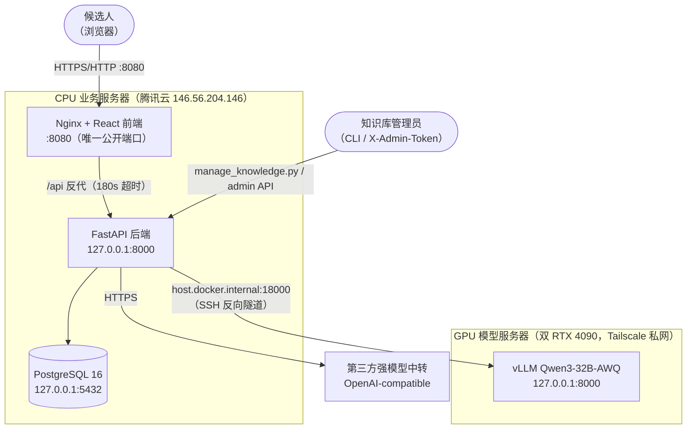
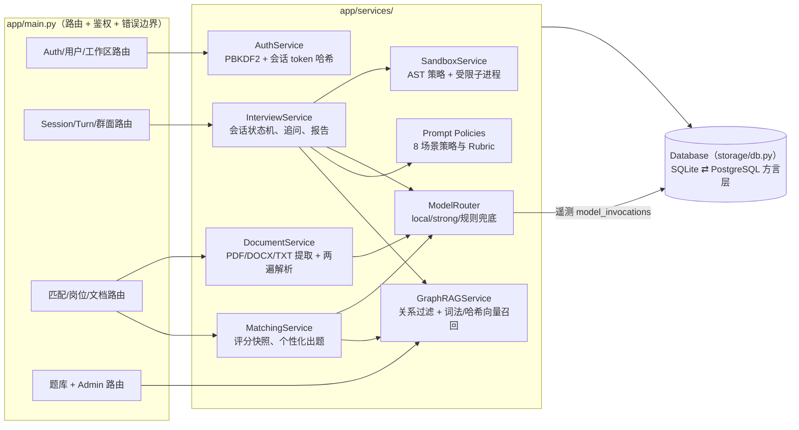
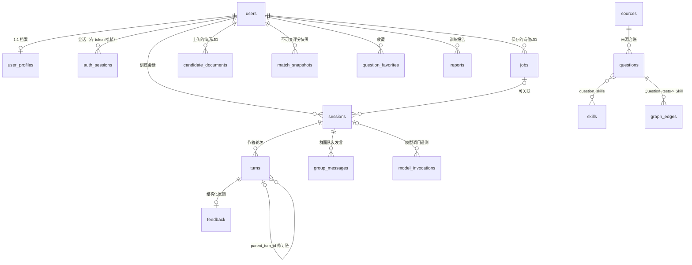
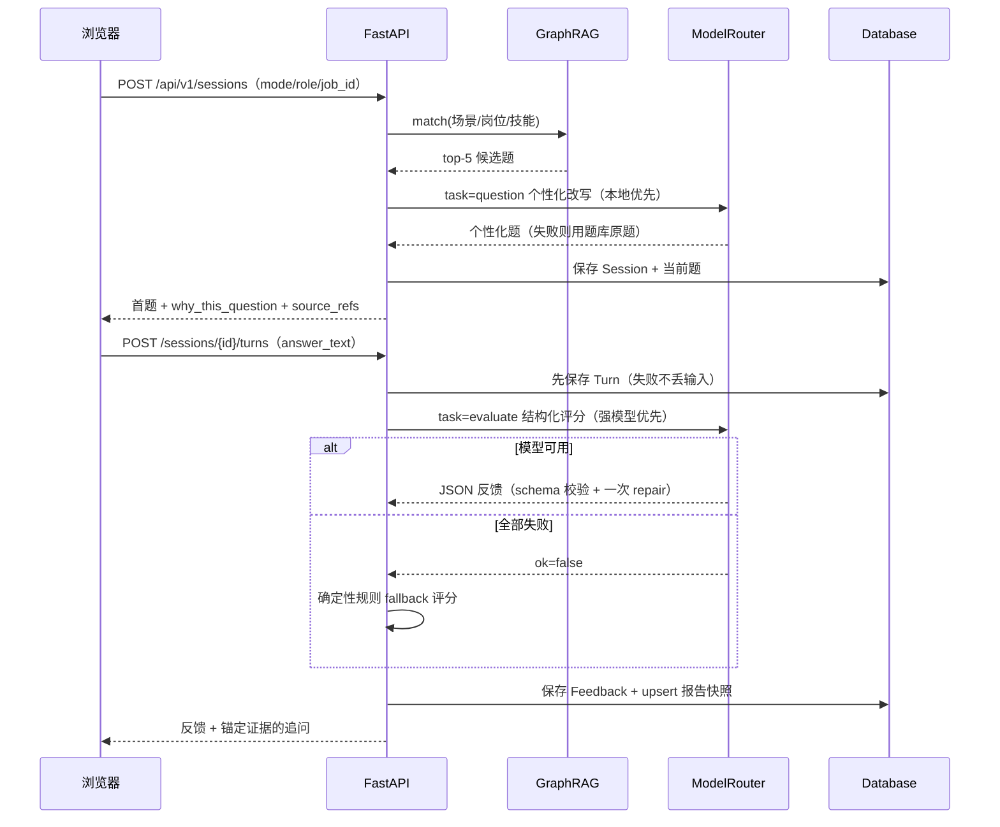
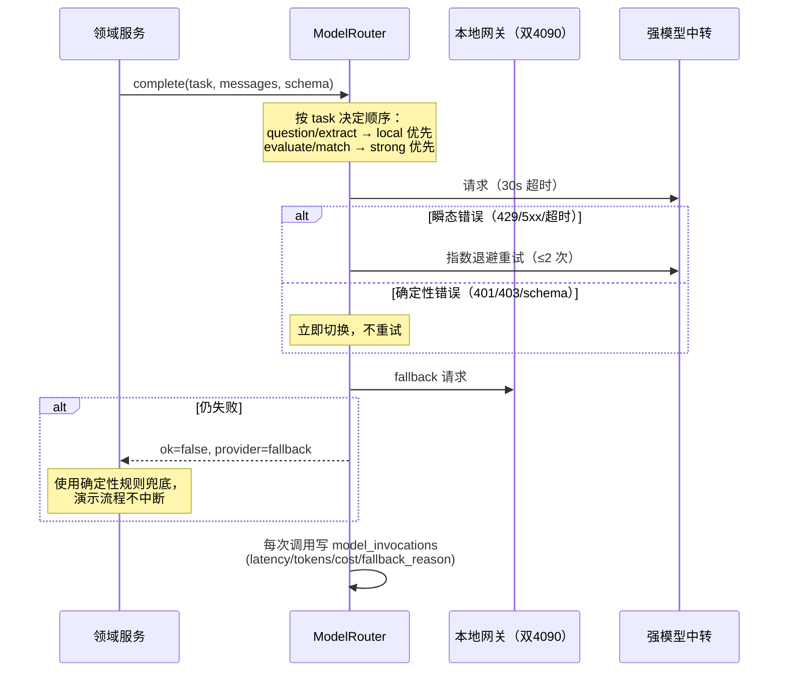
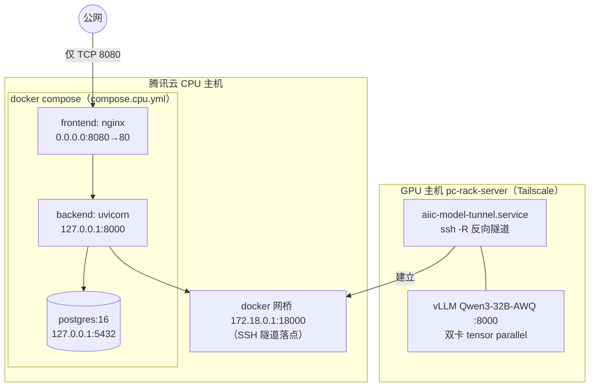

# AIIC 架构与部署图

> 本文档以 Mermaid 描述当前仓库实现的架构视图，与 `docs/system-overview-design.md`（文字版）互为补充。图中所有组件均为 `implemented`，除非明确标注 `planned`。渲染方式：GitHub / IDE 内置 Mermaid 预览，或 `mermaid-cli`。

## 1. 系统上下文图（C4 Level 1）

要点：

- 模型端口、PostgreSQL 与后端 8000 端口均不对公网开放；GPU 网关经 systemd 管理的受限 SSH 反向隧道（`aiic-model-tunnel.service`）转发到 CPU 主机 Docker 网桥 `172.18.0.1:18000`。
- 模型密钥只存在于 CPU 主机 `.env`（0600），不进入浏览器、Git 或数据库。

## 2. 后端组件图（C4 Level 2/3）

## 3. 数据模型 ER 图（核心表）

## 4. 关键时序：一轮文字面试

## 5. 关键时序：模型路由与降级

## 6. 部署拓扑（当前生产）

`compose.gpu.example.yml` 提供 GPU 侧容器化迁移路径（vLLM + LiteLLM 网关、强制 master key、仅绑 loopback/私网）；当前实际 GPU 服务由主机既有 systemd 服务管理。

## 7. 规划中的目标架构增量（planned）

- Redis + 异步 worker（限流、耗时任务卸载）。
- 独立算法沙箱 runner 容器（禁网、只读 FS、seccomp/nsjail）。
- pgvector/真实 embedding 替换哈希向量召回（`ModelRouter.embed()` 已预留）。
- SSE 流式事件（当前 `/sessions/{id}/events` 为占位）。
- 真人群面匹配等待池与房间服务。
